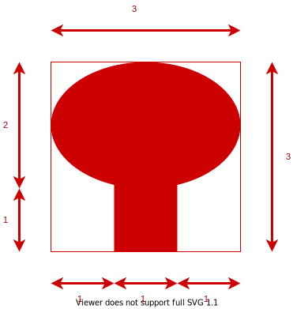

# Riadny termín \[60b], 3.6.2021 14:00
B-OOP 2021

Vytvorte oknovú aplikáciu, ktorá umožní používateľovi kresliť a presúvať zadaný tvar. Aplikácia bude mať nasledovnú funkcionalitu (40 bodov):

1. Vytvorenie hlavného okna, ktoré bude obsahovať Ovládacie prvky a Kresliacu plochu \[5b].
2. Kreslenie jedného tvaru: strom \[15b].
3. Presúvanie už nakreslených tvarov \[15b].
4. Voľba farby geometrického tvaru prostredníctvom [JButton](https://docs.oracle.com/en/java/javase/11/docs/api/java.desktop/javax/swing/JButton.html) \[4b].
5. Zatvorenie aplikácie cez tlačidlo na zatvorenie aplikácie poskytnuté operačným systémom \[1b].

## Podrobný popis k bodu 1:

Väčšinu plochy okna bude zaberať Kresliaca plocha. V dolnej časti okna sa budú nachádzať Ovládacie
prvky. Ovládacie prvky budú tvoriť: [JButton](https://docs.oracle.com/en/java/javase/11/docs/api/java.desktop/javax/swing/JButton.html) “Strom”, [JButton](https://docs.oracle.com/en/java/javase/11/docs/api/java.desktop/javax/swing/JButton.html) “Presun”, [JButton](https://docs.oracle.com/en/java/javase/11/docs/api/java.desktop/javax/swing/JButton.html) “Ďalšia farba” a [JLabel](https://docs.oracle.com/en/java/javase/11/docs/api/java.desktop/javax/swing/JLabel.html). Každý z týchto prvkov musí zaberať štvrtinu celkového miesta vyhradeného pre ovládacie prvky.

## Podrobný popis k bodu 2:

Stlačením príslušného tlačidla si vyberieme kreslenie STROMU [5b]. Po stlačení tlačidla myši (kliknutí) a následným ťahaním, sa na plátno vykresľuje geometrický tvar, a v Labeli (medzi ovládacími prvkami) sa nastaví text, ktorý bude hovoriť, že je aktívne **KRESLENIE**. Podľa aktuálnej polohy kurzora sa dynamicky mení šírka aj výška. Po pustení tlačidla myši sa ukončí kreslenie geometrického tvaru, t.j. jeho veľkosť sa zafixuje, potom sme pripravení kresliť ďalší tvar. Vykreslený tvar musí na kresliacej ploche zostať vykreslený aj po vykreslení ďalšieho tvaru. Takisto si každý tvar musí zachovávať svoju farbu (farba sa bude meniť Button-om, pozri bod 4). Strom musí mať pri kreslení zachované proporcie, ako je znázornené na obrázku.

**Pozn.:** Pri kreslení (ťahaní myšou) zvoleného geometrického tvaru sa musí uvažovať, do akého smeru sa ťahá. Vtedy je potrebné domyslieť, ako sa budú prepočítavať koncové súradnice geometrického tvaru. Ak implementujete prepočítavanie koncového bodu v závislosti od všetkých smerov ťahania myšou (sprava hore - doľava dole, zľava dole - doprava hore, zľava hore - doprava dole a opačne) získate za tento bod plný počet [10b]. Ak neimplementujete všetky 4 alternatívy prepočítavania súradníc koncového bodu (ťahania myšou), získate maximálne polovicu zo stanovených bodov. (max 5b).

## Podrobný popis k bodu 3:

Stlačením príslušného tlačidla si vyberieme mód PRESÚVANIA a Labeli (medzi ovládacími prvkami) sa nastaví text, ktorý bude hovoriť, že je aktívne **PRESÚVANIE**. Po stlačení tlačidla myši (kliknutí) na nejaký už nakreslený tvar a následnom ťahaní sa zvolený tvar bude presúvať spolu s pohybom myši. Po pustení tlačidla myši sa presúvanie ukončí, t.j. presúvaný tvar zostane na svojom novom mieste. Presúvaný tvar sa vykresľuje iba spolu s myšou a nezostáva na svojej pôvodnej pozícii.

**Pozn.:** Pri presúvaní (ťahaní myšou) zvoleného tvaru je potrebné brať do úvahy relatívnu polohy myši ku presúvanému tvaru. Za implementáciu presúvania akýmkoľvek spôsobom je možné získať maximálne 10b. Pokiaľ sa presúvanie uskutočňuje relatívne ku miestu kde bol tvar vybratý myšou (t.j. keď kliknem do stredu útvaru presúvam ho tak, že myš zostáva v strede) dá sa za presúvanie získať plný počet 15b.

Na detekciu kliknutia myši na tvar môžete použiť napríklad metódu [contains](https://docs.oracle.com/en/java/javase/11/docs/api/java.desktop/java/awt/Shape.html#contains(double,double)) triedy [Shape](https://docs.oracle.com/en/java/javase/11/docs/api/java.desktop/java/awt/Shape.html)

## Podrobný popis k bodu 4:

Spomedzi ovládacích prvkov bude Button "Ďalšia farba" slúžiť na výber farby a Label na grafické znázornenie aktuálne  zvolenej farby. Program umožňuje zvoliť minimálne 3 farby v nejakom fixnom poradí (napr. červená > modrá > zelená). Tlačidlom sa aktívna farba zmení na nasledujúcu farbu v poradí. Pokiaľ sa v zozname farieb nachádzame na poslednom prvku, tak za ním nasleduje opäť prvá farba (t.j. červená > modrá > zelená > červená > ...). Práve kreslené geometrické tvary majú farbu zvolenú podľa aktuálnej farby. Farby môžu byť ľubovoľné, podmienkou ale je, aby boli viditeľné na kresliacej ploche. Po výbere farby sa zmení farba Label-u podľa aktuálnej farby. Zmena farby ovplyvňuje len nové geometrické tvary, už nakreslené geometrické tvary si musia zachovať svoju farbu!

## Hodnotenie

Projekt obsahuje github pipeline, ktorá kontroluje skompilovateľnosť programu. **Pokiaľ program nie je skompilovateľný nebude hodnotený a skúška bude hodnotená 0b!**

**Pokiaľ budete počas skúšky pristihnutý pri podvádzaní, alebo bude váš kód vykazovať príliš veľkú podobnosť s kódom iných študentov, bude skúška hodnotená 0 bodmi!**

Okrem funkcionality budú hodnotené aj princípy Objektovo orientovaného programovania (20 bodov), najmä:

* správne využitie modifikátory prístupu, \[3b]
* vhodné pomenovanie tried a metód, \[3b]
* vhodné využitie dedenia a polymorfizmu, \[3b]
* vhodné použitie výnimiek na ošetrenie nedovoleného správania (nehádzať a nezachytávať všeobecnú triedu Exception), \[3b]
* nepoužitie vnorených tried (nested class), \[2b]
* nepoužitie statických metód ani nekonštantných statických premenných, \[3b]
* nepoužitie duplicitných kódov \[3b]

## Odovzdanie

Vypracovanie skúšky odovzdajte cez Github classroom do miesta odovzdania nato určenom. Odovzdáva sa obsah celého projektu. Na vypracovanie písomky je vyhradený čas 3 hodiny.

# Exam RT \[60pts], 3.6.2021 14:00
B-OOP 2021

Your task is to create a java window application. The application allows the user to draw and move a given shape. The application has the following functionality (40 points):

1. Creation of the main window, that will contain control elements and a drawing area \[5pts].
2. Drawing of one shape: a tree \[15pts].
3. Moving of the drawn shapes \[15pts].
4. Selection of the drawing color through a [JButton](https://docs.oracle.com/en/java/javase/11/docs/api/java.desktop/javax/swing/JButton.html) \[4pts].
5. Closing the application with the "close window" button provided by the operating system \[1pt].

## Description for bullet point 1:

Most of the window area will be covered by the drawing area. THe bottom part of the window will contain the control elements. The control elements consist of: [JButton](https://docs.oracle.com/en/java/javase/11/docs/api/java.desktop/javax/swing/JButton.html) "Tree", [JButton](https://docs.oracle.com/en/java/javase/11/docs/api/java.desktop/javax/swing/JButton.html) "Move", [JButton](https://docs.oracle.com/en/java/javase/11/docs/api/java.desktop/javax/swing/JButton.html) "Next color" and a [JLabel](https://docs.oracle.com/en/java/javase/11/docs/api/java.desktop/javax/swing/JLabel.html). Each of these elements should cover a fourth of the available space for control elements.

## Description for bullet point 2:

By pressing the appropriate button we select drawing of the TREE [5pts]. After pressing the left mouse button and draging the mouse the selected shape will begin drawing on to the drawing area. The label (from the control elements) will have its text changed to **DRAWING**. Based on the current position of the mouse, the width and height of the drawn shape will be dynamically adjusted. After letting go of the left mouse button the drawing of the shape will complete, i.e. its position and size fill be fixed. The drawn shape must remain on the drawing area after drawing additional shapes. Each shape must maintain its color (the color will change based on a button, see bullet point 4). The tree shape must maintain the proportions depicted on the image bellow.

**Note:** When drawing (dragging the mouse) a shape the position and direction of the mouse must be considered. You must consider how to calculate the position and size of the selected shape. If you implement the drawing of the shape into all four direction the mouse can be dragged in (top right to bottom left, bottom left to top right, top left to bottom right, bottom right to top left) you will receive the full [10pts]. If you do not implement all four possibilities you will be able to recive at most a half of the available points (max 5pts).

## Description for bullet point 3:

By pressing the appropriate button the **MOVING** mode will be selected and the appropriate text of the label (in the controll panel) will be set. After pressing the left mouse button on an already drawn shape and then dragging the mouse, the selected shape will move with the mouse. After letting go of the left mouse button the movement of the shape will finish i.e. the shape will remain fixed in its new place. THe dragged shape will be drawn only at the position of the mouse and will not remain at its original location.

**Note:** When moving (dragging the mouse) of a selected shape you must consider the relative position of the mouse to the moved shape. For implementing the dragging in any way at most 10pts can be received. If the movement is performed relative to the click location of the mouse (i.e. when dragging from the center of the shape the mouse remains in the center of the shape during the movement) you will receive the full 15pts.

You can use the [contains](https://docs.oracle.com/en/java/javase/11/docs/api/java.desktop/java/awt/Shape.html#contains(double,double)) method of the [Shape](https://docs.oracle.com/en/java/javase/11/docs/api/java.desktop/java/awt/Shape.html) class to determine whether the mouse was pressed inside of a shape.

## Description for bullet point 4:

Among the control elements the Button "Next color" will serve the purpose of selecting the drawing color. The Lable will display the currently selected color. The program allows the selection of at least 3 different colors in some fixed order (e.g. red > blue > green). By pressing the button the selected color will change to the next color in the ordering. If the currently selected color is the last color in the ordering, the next color is the first color of the ordering (i.e. red > blue > green > red > ...). The currently drawn shapes have the currently selected color. You can choose the available colors freely, but they must be clearly visible on the drawing area. After selecting a color the color of the Label will change based on the currently selected color. The change of the color affect only new shapes, the shapes that are already drawn must maintain their color!

## Grading

The project contains a github pipeline, that checks whether it can be compiled or not. **If the program cannot be compiled it will not be graded and 0 points will be received for the exam!**.

**If you are caught cheating during the exam, or if the source code handed in by you will have a suspicious amount of similarities with the code of other students 0 points will be received for the exam!**

Appart from the functionality, the principles of Object-Oriented Programming will be graded as well (20 pts), pay close attention especially to:

* correct usage of access modifiers, \[3pts]
* appropriate naming of classes and methods, \[3pts]
* appropriate usage of inheritance and polymorphism, \[3pts]
* appropriate usage of exceptions when handling undesired behavior (do not catch or throw the instances of the generic Exception class), \[3pts]
* don't use nested classes, \[2pts]
* don't use static methods, or non-constant static variables, \[3pts]
* don't have code duplication \[3pts]

## Odovzdanie

Vypracovanie skúšky odovzdajte cez Github classroom do miesta odovzdania nato určenom. Odovzdáva sa obsah celého projektu. Na vypracovanie písomky je vyhradený čas 3 hodiny.

## Handing in the assigment

Hand in the assignment into your Github classroom repository for this exam. Hand in the entire project. You have 3 hours to complete the exam.