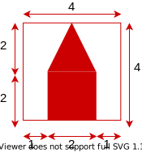

# Opravný termín \[60b], 24.6.2021 14:00
B-OOP 2021

Vytvorte oknovú aplikáciu, ktorá umožní používateľovi "pečiatkovať" dva tvary a spájať ich pomocou čiar. Aplikácia bude mať nasledovnú funkcionalitu (40 bodov):

1. Vytvorenie hlavného okna, ktoré bude obsahovať Ovládacie prvky a Kresliacu plochu \[4b].
2. Sfunkčnenie ovládacích prvkov pomocou Listenerov \[5b].
3. "Pečiatkovanie" dvoch tvarov: strom a dom \[10b].
4. Prepájanie tvarov pomocou čiar \[15b].
5. Zmena farieb počas kreslenia a vrstvenie elementov \[5b].
6. Zatvorenie aplikácie cez tlačidlo na zatvorenie aplikácie poskytnuté operačným systémom \[1b].

## Podrobný popis k bodu 1:

Väčšinu plochy okna bude zaberať Kresliaca plocha. V hornej časti okna sa budú nachádzať Ovládacie
prvky. Ovládacie prvky budú tvoriť: [JButton](https://docs.oracle.com/en/java/javase/11/docs/api/java.desktop/javax/swing/JButton.html) “Strom”, [JButton](https://docs.oracle.com/en/java/javase/11/docs/api/java.desktop/javax/swing/JButton.html) “Dom”, [JButton](https://docs.oracle.com/en/java/javase/11/docs/api/java.desktop/javax/swing/JButton.html) “Cesta” a [JLabel](https://docs.oracle.com/en/java/javase/11/docs/api/java.desktop/javax/swing/JLabel.html). Každý z týchto prvkov musí zaberať štvrtinu celkového miesta vyhradeného pre ovládacie prvky.

## Podrobný popis k bodu 2:

Po spustení programu je zvolený ľubovoľný z módov "Dom" alebo "Strom". Aktuálne zvolený mód sa zobrazuje ako text na [JLabel](https://docs.oracle.com/en/java/javase/11/docs/api/java.desktop/javax/swing/JLabel.html) elemente na ovládacom paneli ("Dom", "Strom", "Cesta"). Aktívny mód sa zmení iba kliknutím na príslušný [JButton](https://docs.oracle.com/en/java/javase/11/docs/api/java.desktop/javax/swing/JButton.html) na ovládacom panely. Label má nastavenú farbu pozadia podľa aktuálne zvolenej farby (pozri bod 5).

## Podrobný popis k bodu 3:

Keď je zvolený jeden z módov "Dom" alebo "Strom", tak používateľ má možnosť pridávať príslušné tvary na kresliacu plochu. Kreslenie prebieha formou pečiatkovania, teda po kliknutí sa na mieste na ktoré sa kliklo vykreslí zvolený tvar \[2b]. Tvar sa vykresľuje tak, že jeho stred sa nachádza v mieste kam klikla myš \[3b]. Tvary nakreslené v minulosti zostávajú po kliknutí na kresliacej ploche. Tvary majú fixný rozmer 50\*50px. Na pozícii myši sa zobrazuje polopriehľadný náhľad aktuálne zvoleného tvaru/pečiatky \[5b]. Tvar aj náhľad sa vykresľuje aktuálne zvolenou farbou (pozri bod 5). Pokiaľ funguje vykresľovanie iba jedného tvaru je úloha hodnotená maximálne polovičným počtom bodov. Tvary majú mať nasledovné proporcie:

## Podrobný popis k bodu 4:

Keď je zvolený mód "Cesta" je možné prepájať domy a stromy čiarami. Cestu (čiaru) je možné začať kresliť stlačením myši nad nejakým nakresleným tvarom. Následne sa pri ťahaní myši kreslí čiara medzi stredom tvaru a aktuálnou pozíciou myši. Pokiaľ je tlačidlo myši pustené nad prázdnou plochou, čiara zmizne. Pokiaľ je tlačidlo myši pustené nad tvar opačného druhu, ako je začiatok čiary, tak sa kreslenie čiary dokončí a čiara bude spájať stredy nakreslených tvarov \[10b]. Čiarami je možné spájať iba tvary opačného druhu (dom - strom, strom - dom) \[5b]. Čiary sa vždy vykresľujú čiernou farbou.

Na detekciu kliknutia myši na tvar môžete použiť napríklad metódu [contains](https://docs.oracle.com/en/java/javase/11/docs/api/java.desktop/java/awt/Shape.html#contains(double,double)) triedy [Shape](https://docs.oracle.com/en/java/javase/11/docs/api/java.desktop/java/awt/Shape.html)

## Podrobný popis k bodu 5:

Program obsahuje minimálne 3 farby v nejakom fixnom poradí (napr. červená > modrá > zelená). Na začiatku programu je zvolená prvá farba z poradia (tým pádom je takou farbou podfarbený aj label). Po nakreslení ľubovoľného z tvarou sa aktuálna farba zmení na nasledujúcu v poradí. Po zmene farby sa zmení farba Label-u podľa aktuálnej farby. Zmena farby ovplyvňuje len nové geometrické tvary, už nakreslené geometrické tvary si musia zachovať svoju farbu! 

Poradie vykreslovania prvkov musí byť také, že: Tvary > Čiary > Náhľad zvoleného tvaru (ak je zvolený mód Dom alebo Strom) 

## Hodnotenie

Projekt obsahuje github pipeline, ktorá kontroluje skompilovateľnosť programu. **Pokiaľ program nie je skompilovateľný nebude hodnotený a skúška bude hodnotená 0b!**

**Pokiaľ budete počas skúšky pristihnutý pri podvádzaní, alebo bude váš kód vykazovať príliš veľkú podobnosť s kódom iných študentov, bude skúška hodnotená 0 bodmi!**

Okrem funkcionality budú hodnotené aj princípy Objektovo orientovaného programovania (20 bodov), najmä:

* správne využitie modifikátory prístupu, \[3b]
* vhodné pomenovanie tried a metód, \[3b]
* vhodné využitie dedenia a polymorfizmu, \[3b]
* vhodné použitie výnimiek na ošetrenie nedovoleného správania (nehádzať a nezachytávať všeobecnú triedu Exception), \[3b]
* nepoužitie vnorených tried (nested class), \[2b]
* nepoužitie statických metód ani nekonštantných statických premenných, \[3b]
* nepoužitie duplicitných kódov \[3b]

Pokiaľ vaše riešenie neobsahuje dostatok implementácie je možné za OOP získať maximálne \[10b]. 

## Odovzdanie

Vypracovanie skúšky odovzdajte cez Github classroom do miesta odovzdania nato určenom. Odovzdáva sa obsah celého projektu. Na vypracovanie písomky je vyhradený čas 3 hodiny.

# Exam OT \[60pts], 24.6.2021 14:00
B-OOP 2021

Your task is to create a java window application. The application allows the user to "stamp" two shapes and connect them with lines. The application has the following functionality (40 points):

1. Creation of the main window, that will contain control elements and a drawing area \[4pts].
2. Implementation of the functionality of the controll elements \[5pts].
3. "Stamping" of two shapes: a house and a tree \[10pts].
4. Connecting the shapes with lines \[15pts].
5. Changing the colour of the shapes and the layering of elements \[5pts].
6. Closing the application with the "close window" button provided by the operating system \[1pt].

## Description for bullet point 1:

Most of the window area will be covered by the drawing area. The top part of the window will contain the control elements. The control elements consist of: [JButton](https://docs.oracle.com/en/java/javase/11/docs/api/java.desktop/javax/swing/JButton.html) "Tree", [JButton](https://docs.oracle.com/en/java/javase/11/docs/api/java.desktop/javax/swing/JButton.html) "House", [JButton](https://docs.oracle.com/en/java/javase/11/docs/api/java.desktop/javax/swing/JButton.html) "Road" and a [JLabel](https://docs.oracle.com/en/java/javase/11/docs/api/java.desktop/javax/swing/JLabel.html). Each of these elements should cover a fourth of the available space for control elements.

## Description for bullet point 2:

When the program starts, either the "House" or the "Tree" drawing mode is selected. The currently selected mode is displayed as text on the [JLabel](https://docs.oracle.com/en/java/javase/11/docs/api/java.desktop/javax/swing/JLabel.html) on the controll panel ("House", "Tree", "Road"). The currently selected mode changes only by pressing the appropriate buttons on the control panel. The label has a background color according to the currently selected color (see bullet point 5).

## Description for bullet point 3:

When either the "House" or the "Tree" mode is selected, the user can add the selected shape to the drawing area. The drawing is done by stamping the selected element, that is after the user clicks on the drawing area the selected shape will be drawn at the clicked location \[2pts]. The shapes are positioned in such a way they are centered on the mouse click position \[3pts]. Shapes drawn in the past remain on the drawing area. The shapes have a fixed dimension o 50\*50px. A preview of the currenlty selected shape/stamp is displayed at the position of the mouse \[5pts]. Both the shape and the preview are displayed with the currently selected color (see bullet point 5). If only one shape is implemented you can get at most half of the points for this section. The shapes have the following proportions:

## Description for bullet point 4:.

When the currently selected mode is "Road" the user can connect trees and houses with lines. The road (line) can be started by pressing the mouse on top of some shape. When dragging the mouse a line is drawn between the center of the selected shape and the current position of the mouse. If the the mouse button is let go above empty space, the line disappears. If the mouse button is let go above a shape with the type oposite to the start of the line, the line will be completed and will connect the centers of the two shapes \[10pts]. Only shapes of oposite types (house - tree, tree - house) can be connected with lines \[5pts]. Lines are always drawn with black color.

You can use the [contains](https://docs.oracle.com/en/java/javase/11/docs/api/java.desktop/java/awt/Shape.html#contains(double,double)) method of the [Shape](https://docs.oracle.com/en/java/javase/11/docs/api/java.desktop/java/awt/Shape.html) class to determine whether the mouse was pressed inside of a shape.

## Description for bullet point 5:

The program defines at least 3 different colors in some fixed order (e.g. red > blue > green). At the start of the application the first color is selected (and therefore the label has the selected colour as its background). Whenever a shape is drawn the current color is changed to the next color. The change of the color affects only the new shapes, the shapes that are already drawn must maintain their color!

The order in which the elements are drawn must be as follows: Shapes > Lines > shape preview (if either the "house", or the "tree" mode is selected)

## Grading

The project contains a github pipeline, that checks whether it can be compiled or not. **If the program cannot be compiled it will not be graded and 0 points will be received for the exam!**.

**If you are caught cheating during the exam, or if the source code handed in by you will have a suspicious amount of similarities with the code of other students 0 points will be received for the exam!**

Appart from the functionality, the principles of Object-Oriented Programming will be graded as well (20 pts), pay close attention especially to:

* correct usage of access modifiers, \[3pts]
* appropriate naming of classes and methods, \[3pts]
* appropriate usage of inheritance and polymorphism, \[3pts]
* appropriate usage of exceptions when handling undesired behavior (do not catch or throw the instances of the generic Exception class), \[3pts]
* don't use nested classes, \[2pts]
* don't use static methods, or non-constant static variables, \[3pts]
* don't have code duplication \[3pts]

If the code does not contain enough implementation, you can get at most \[10pts] for conforming to the OOP principles.

## Handing in the assigment

Hand in the assignment into your Github classroom repository for this exam. Hand in the entire project. You have 3 hours to complete the exam.
